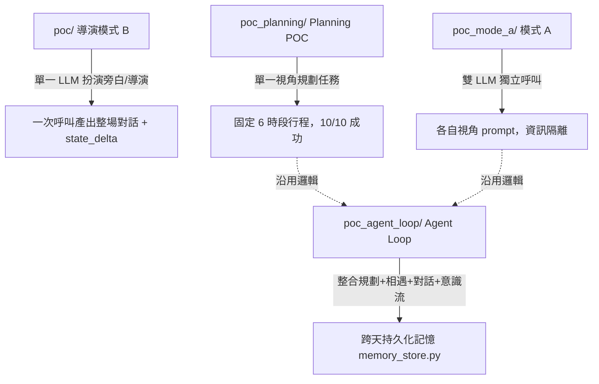

# POC 完整技術文件：架構、測試方法、檔案整理、對話資料流程

> [!info] 用途
> 彙整目前所有 POC 線的架構、驗證方法、檔案組織方式、對話資料的儲存/續寫/篩選機制，作為單一入口文件。細節與逐次實驗紀錄仍以 [[POC 紀錄 - 導演模式 B]]、[[POC 紀錄 - 原 Ailley 多模型互動]]、[[POC 架構總覽與 Generative Agents 論文比對]] 為準，這份文件是「一眼看全貌」用的整理版，不重複貼實驗數據，只做索引與骨架說明。

> [!warning] 分支狀態
> 以下內容以主 checkout `/home/neon/Projects/Ailley`、分支 `agent-loop-persistent-memory`（已與 `neon-POC` 對齊）為準。目前這份筆記所在的 worktree（`worktree-lucky-doodling-cray`）是重整前的舊分支，`poc/` 目錄只剩 3 支殘留檔案，**不是**目前的真實狀態，僅供比對參考。

---

## 一、整體架構：四條自包含的 POC 線

全部跑同一顆本地 `llama-server`（Qwen2.5-7B-Instruct-Q4_K_M，`.gbnf` grammar 鎖死 JSON 輸出結構），彼此**不互相 import**，靠複製貼上共用邏輯（`characters.py`、`call_director()`、洩漏偵測函式在四個目錄裡各有一份）。這是刻意的設計，不是疏漏——POC 階段要讓實驗互不干擾，代價是之後要合併時同一個 bug 得改四五次（詳見 [[POC 架構總覽與 Generative Agents 論文比對]] 第四節）。



| 目錄 | 核心腳本 | 定位 | 目前狀態 |
|---|---|---|---|
| `poc/` | `director_poc.py`、`continue_director_poc.py` | 單一 LLM 扮演導演/旁白，一次呼叫產出整場（或整批續寫）劇本＋`state_delta`（懷疑度、洩漏判定） | 主線，多個實驗分支併回來 |
| `poc/`（雲端對照） | `director_poc_cloud.py` | 打 OpenRouter，事後 `json.loads` 容錯解析，無 grammar 約束 | 對照組，非正式產線 |
| `poc_mode_a/` | `dialogue_ping_pong.py`、`dialogue_ping_pong_memory.py`、`dialogue_ping_pong_memory_embed.py` | 兩顆獨立呼叫互相對話，各自只看自己視角的 prompt，不共用導演視角（資訊隔離） | `_memory.py` 是目前版本，`_embed.py` 是已驗證但未採用的分支 |
| `poc_planning/` | `generate_plans.py` | 固定 6 時段行程規劃，grammar 鎖死結構 | 品質最好、最穩定的一塊 |
| `poc_agent_loop/` | `agent_loop.py`、`memory_store.py`、`run_multiday.py` | 規劃 → 行程重疊觸發相遇 → 對話 → 意識流 → 跨天持久化記憶 | 最新、整合度最高的一條線，已驗證到 10 人規模 |

### 各線之間的實驗分支（`poc/` 內部）

`poc/` 目錄下大量 `continue_director_poc_*.py` / `chain_continue_*.py` 都是針對「長鏈重複退化」的獨立修復嘗試：

| 分支檔名 | 修復思路 | 結論 |
|---|---|---|
| `*_repeat_guard` | 呼叫前偵測＋注入提示 | 樣本數足夠後未優於 baseline，未採用 |
| `*_batch_regen` | 呼叫後偵測＋整批重生 | v1/v2 都未優於 baseline，未採用 |
| `*_misdirect_settle` | 誤導後強制收斂 | 未採用 |
| `*_repeat_end` | 把重複當成強制結束觸發 | 未採用 |
| `*_natural_end` | 讓對話自然收尾機制 | 獨立功能，非重複退化修復，已保留 |
| `*_narrowwindow` | 縮小 `RECENT_TURNS_WINDOW`（12→6） | **唯一驗證有效並正式併入**（-53% 重複組數） |

三次獨立的「加偵測/加邏輯」嘗試都打不穿，只有「縮短視窗長度」這個最簡單的改動有效，且在 `poc/`（模式 B）與 `poc_mode_a/`（模式 A）兩個不同架構下獨立驗證出一致的效果幅度——這是目前整條 session 累積下來最重要的單一結論。

---

## 二、測試/驗證方法論

所有 POC 線共用同一套驗證框架，四個核心指標：

### 1. 完成率 / 崩潰率
跑固定批次（例如 15 條鏈、5 場、10 人規模 5 次批次），數 JSON 解析成功 vs 失敗、連線/HTTP 錯誤、崩潰。三種已知崩潰模式見下方「已知問題」。

### 2. 機密洩漏偵測（文字比對，非模型自陳）
每個目錄各自維護 `core_energy_leaked()` / `altar_key_leaked()`（例：`poc/continue_director_poc.py:71-78`、`poc_agent_loop/agent_loop.py:82-87`）——直接對 `dialogue` 欄位做字串/關鍵詞比對，判定是否真的洩漏了核心能源或密鑰名稱。**同時會拿模型自己回報的 `state_delta.reveals_core_energy` / `reveals_altar_key` 跟文字比對結果交叉驗證**（`continue_director_poc.py:426-436`），兩者不一致時印出 `[警訊]`——這是防止「模型自陳沒洩漏，但文字其實洩漏了」或反過來的漏檢/誤判。判定邏輯**不信任模型自我報告**，一律以文字比對為準。

### 3. 重複退化量化
逐回合比對 dialogue 文字，統計「重複組」（同一句話或高度相似句子出現的組數）。這是貫穿整條 session 的核心指標，baseline（無視窗限制）約 8.60 組/場，縮窗後降到 4.00 組/場。10 人規模批次測出對話重複率 74%（53 組相遇裡 39 組出現重複），是目前最大的量化基準值。

### 4. 退化輸出（空白/省略號）
10 人版批次首次量出系統性數字：318 回合中 21 次輸出退化為空白或「...」，佔比 6.6%。是獨立於逐字重複的另一種失敗模式，目前無偵測/緩解機制。

### 驗證規模與慣例
- **固定 SEED**：控制實驗變因，方便同構對照（例如 narrowwindow 的「15 條鏈同構對照」）。
- **批次大小**：小規模驗證用 2 人、5 次；規模化驗證用 10 人固定角色卡全員、5 次批次。
- **鏈式延長驗證**：用 `chain_continue*.py` 把多個 6 回合 chunk 串接到 26-36 回合，觀察退化是否隨鏈長累積。
- **耗時記錄**：每次驗證附帶總耗時，作為之後效能規模化評估的基準數據（10 人版一天約 6.4 分鐘）。

---

## 三、檔案整理

### 目錄結構（主 checkout，`agent-loop-persistent-memory` 分支）

```
Ailley/
├── poc/                          # 導演模式 B
│   ├── director_poc.py           # 單次生成整場劇本
│   ├── continue_director_poc.py  # 讀取既有 transcript，接續生成 N 回合
│   ├── director_poc_cloud.py     # 雲端對照（OpenRouter）
│   ├── continue_director_poc_*.py / chain_continue_*.py  # 實驗分支（見上表）
│   ├── characters.py             # 角色卡定義
│   ├── characters/                # 角色資料
│   ├── grammar/                  # .gbnf.template，鎖 JSON 結構
│   ├── prompts/                  # world_lore.txt 等世界觀素材
│   ├── schema/script_schema.json # 劇本 JSON schema
│   ├── transcripts/               # 產出的對話紀錄（302+ 個檔案）
│   └── test_*.py                 # 個別功能測試腳本
├── poc_mode_a/                   # 模式 A：雙 LLM 獨立呼叫
│   ├── dialogue_ping_pong.py             # 舊版，仍在用
│   ├── dialogue_ping_pong_memory.py      # 加記憶流評分（新近度+重要性），n_predict 修法原始出處
│   ├── dialogue_ping_pong_memory_embed.py # 加 embedding 相關性檢索，驗證有副作用未採用
│   ├── characters.py / grammar/ / prompts/ / transcripts/
├── poc_planning/                 # Planning 最小可行 POC
│   └── generate_plans.py
├── poc_agent_loop/               # Agent Loop：規劃→相遇→對話→意識流→跨天記憶
│   ├── agent_loop.py             # 主流程
│   ├── memory_store.py           # 跨天持久化層（roster.json / state.json / memories/）
│   ├── run_multiday.py           # 跨天批次執行入口
│   ├── characters.py / grammar/ / prompts/ / transcripts/
└── note/                         # Obsidian 筆記庫，所有計畫/進度/實驗紀錄
```

### transcripts 命名慣例
檔名格式：`<時間戳記>[_continued_from_<上一份的時間戳記>[_continued_from_...]].json`——每次續寫都把來源檔名疊加進新檔名，形成一條可追溯的鏈（見上方「三、檔案整理」範例檔名）。`_cloud` 後綴標示雲端對照組，`_natural_end` 標示觸發自然收尾機制的批次。這個命名法本身就是完整的資料血緣（provenance）記錄，不需要另外的 metadata 檔。

### 分支狀態
`neon-POC` 已 fast-forward 到跟 `agent-loop-persistent-memory` 同一個 commit（目前 HEAD 為 `3707ee3`，n_predict 崩潰防禦修復），兩者是同一條線，不是分岔。四個 POC 目錄本來就同時存在於這條線的同一批 commit 歷史裡。

---

## 四、對話資料的匯入/續寫與篩選機制

### 匯入（續寫既有對話）
`continue_director_poc.py` 的核心設計就是「匯入」機制：讀取一份已存的 `transcript.json`，把角色設定＋前情提要＋目前遊戲狀態（懷疑度、是否已洩漏）重新組成 prompt，請導演模型接續生成後面的 N 回合，而不是重新開一場新戲。目的是把長對話拆成多個短 chunk 分批生成，讓每一段都落在「不會退化」的安全區間內，藉此疊出比單次生成更長的完整劇本。

**前情提要視窗**（`RECENT_TURNS_WINDOW = 6`，`poc/continue_director_poc.py:46`）：續寫時只把「最近幾回合」餵進 prompt，不逐字塞整段歷史——這正是第二節提到的、唯一驗證有效的重複退化緩解手段，同時也是「匯入」機制本身的一部分（決定匯入多少既有內容）。

`chain_continue.py` 再包一層：重複呼叫 `continue_director_poc.py`，每次都接在上一次輸出的最新 transcript 後面，直到洩漏發生、遊戲規則判定結束，或跑滿指定續寫輪數，藉此觀察洩漏機率/敘事品質隨回合數拉長的變化趨勢。

### 篩選（事後品質判定）
「篩選」目前不是一個獨立的資料清洗步驟，而是內嵌在驗證流程裡的**即時判定**，發生在每回合輸出之後、寫入 transcript 之前的同一次迴圈裡：
1. **洩漏篩選**：`core_energy_leaked()` / `altar_key_leaked()` 文字比對，判定回合是否洩漏機密，並與模型自陳交叉驗證（見第二節）。
2. **重複篩選**：逐回合比對 dialogue 文字，統計重複組數，用於事後分析報告，不會中斷生成流程本身（`repeat_guard`/`batch_regen` 兩種「事中攔截」嘗試都已驗證無效並淘汰）。
3. **崩潰防禦**（新增，`3707ee3`）：JSON 解析失敗時重打一次（最多 2 次嘗試），失敗才真正中止；`n_predict` 依呼叫類型設定有界上限，避免不設限的生成撐爆/卡死。這一層是「防止資料進不了 transcript」，跟上面兩種「資料進去之後怎麼評分」是不同階段。

目前**沒有**把「篩選」用於選出高品質對話去做進一步用途（例如匯入遊戲內容、做 LoRA 訓練資料）——這條路徑在 [[POC 紀錄 - 原 Ailley 多模型互動]] 的「AI 程度調校」段落裡被提出作為長期選項（用乾淨對局做微調訓練資料），但**尚未實作**，目前的篩選只用於驗證報告與偵錯，不是資料管線的一部分。

---

## 五、已知問題總覽（跨所有 POC 線）

| 問題 | 頻率/程度 | 狀態 |
|---|---|---|
| 長鏈重複退化 | baseline 74%／8.60 組/場，縮窗後 -53% | 已緩解（縮窗），未根治，三種修復嘗試均未打穿 |
| 退化輸出（空白/省略號） | 6.6%（318 回合中 21 次） | 未處理，無偵測機制 |
| JSON 崩潰-單欄位失控複製 | ~7%（1/15 鏈） | 已修復（`n_predict` 上限，`3707ee3`） |
| JSON 崩潰-引號混用 | ~7%（1/15 場） | 已修復（同上） |
| JSON 崩潰-grammar `ws` 規則卡死 | 個別案例 | 已修復（`dialogue_ping_pong_memory.py` 首發，已推廣） |
| 角色身分一致性（搞混所屬村莊） | 1 次（5 場批次） | 已記錄，未處理，樣本太小 |
| 地點關鍵詞觸發相遇過密 | 10 人規模 10.6 組/60 人-時段（約 1/3） | 已記錄，未處理，需要重新設計粒度 |

## 六、延伸閱讀

- [[POC 紀錄 - 導演模式 B]]——模式 B 全部實驗的逐次紀錄與數據
- [[POC 紀錄 - 原 Ailley 多模型互動]]——模式 A / Planning / Agent Loop 的可行性評估與擴大規模驗證
- [[POC 架構總覽與 Generative Agents 論文比對]]——跟 Stanford Generative Agents 論文的元件級落差分析與合併風險評估
- [[任務交接 - JSON崩潰防禦修復（n_predict 上限）]]——n_predict 修復的原始交接筆記（已完成，`3707ee3`）
- [[開放問題與待決策]]——遊戲設計層面的開放問題（跟本文件的技術範疇不同）
