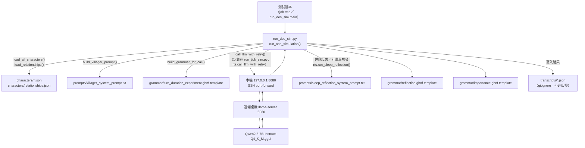
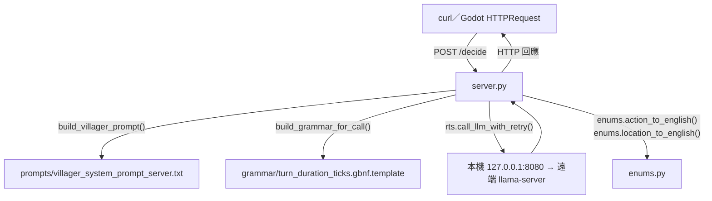

# POC 檔案地圖：poc_village_sim 檔案與資料流程

> [!info] 用途
> `poc_village_sim/` 目前實際會用到的所有檔案，按「餵給模型的東西」「組 prompt 用的底層資料」「引擎程式」「模型回傳資料存放處」四類整理路徑與用途，作為快速查找索引。逐次實驗數據跟設計討論仍以 [[POC 紀錄 - poc_village_sim 五人整合試跑（新版 AI 架構首測）]] 為準，這份文件只做「這個東西在哪裡」的地圖，不重複貼實驗結果。

全部路徑相對於 `/home/neon/Projects/Ailley/poc_village_sim/`。

---

## 零、測試呼叫路徑圖

目前**大部分驗證測試**走的路徑（`run_des_sim.py`，DES 引擎）：



`server.py`（給 Godot／組員串接用，另一條獨立路徑，無狀態、不寫 transcripts）：



## 一、Prompt 模板（餵給模型的文字）

| 檔案 | 用途 |
|---|---|
| `prompts/villager_system_prompt.txt` | 主要決策 prompt——`run_tick_sim.py`／`run_des_sim.py` 共用，村民每次決策都用這份。含 `{{TODAY_PLAN_BLOCK}}` 等佔位符，由 `characters.py` 的 `build_villager_prompt()` 逐一替換組出完整 prompt |
| `prompts/villager_system_prompt_server.txt` | `server.py`（組員串接 API）專用變體，比上面那份多一段 `duration_ticks` 單位說明，故意獨立成另一份檔案，避免動到 `run_des_sim.py` 那條「不加語意提示、純看 AI 自然填什麼」的實驗設計 |
| `prompts/sleep_reflection_system_prompt.txt` | 睡眠反思／計畫層專用 prompt，產出 `reflection`（反思）、`personality_delta`（人格微調）、`long_term_memory`（濃縮記憶）、`today_plan`（當日意圖計畫） |

## 二、Grammar（限制模型輸出格式的結構約束，跟 prompt 一起送給 llama-server 的 `/completion`）

| 檔案 | 對應引擎 | 時長欄位 |
|---|---|---|
| `grammar/turn.gbnf.template` | `run_tick_sim.py` | 無（固定 15 分鐘一個 tick，不需要模型自己填時長） |
| `grammar/turn_duration_experiment.gbnf.template` | `run_des_sim.py` | `duration_minutes`（分鐘制，DES stage 1 實驗線，故意不加語意提示） |
| `grammar/turn_duration_ticks.gbnf.template` | `server.py` | `duration_ticks`（10 秒為一個 tick 的整數，×10 換算成秒） |
| `grammar/reflection.gbnf.template` | 睡眠反思／計畫層（兩個引擎共用 `run_tick_sim.run_sleep_reflection()`） | — |
| `grammar/importance.gbnf.template` | 反思產出的長期記憶要不要記、重要性評分用 | — |

## 三、組 prompt 用的底層資料（角色初始狀態／關係，手動維護、進版控）

| 檔案 | 用途 |
|---|---|
| `characters/alan.json`、`zhou.json`、`mei.json`、`tie.json`、`aji.json` | 五個角色（阿蘭／老周／小梅／鐵牛／阿吉）的初始六維人格、生理數值、位置、背包、初始傷病狀態，`characters.py` 的 `load_character()`／`load_all_characters()` 讀這些 |
| `characters/relationships.json` | 角色間好感度初始值，`load_relationships()`／`get_affection()` 讀這份 |

## 四、引擎與服務程式

| 檔案 | 定位 |
|---|---|
| `characters.py` | 共用底層：角色/關係讀取、六維人格與生理狀態的 tier 文字產生（`hunger_tier_text` 等）、`build_villager_prompt()` 組完整 prompt |
| `memory_store.py` | 記憶檢索/渲染（`retrieve_memories()`／`render_memory_block()`），給決策 prompt 用的短期記憶區塊 |
| `run_tick_sim.py` | 固定 15 分鐘一個 tick 的主引擎，`ThreadPoolExecutor` 平行呼叫五人決策；也是 `SHARED_LOCATIONS`／攻擊機制常數／`call_llm_with_retry()`／`run_sleep_reflection()` 等共用函式的原始定義處，`run_des_sim.py` 大量 `import run_tick_sim as rts` 重用 |
| `run_des_sim.py` | 離散事件模擬（DES）引擎，`heapq` 排程、變動時長、支援同 tick 中斷機制（A 攻擊 B 時 B 手上動作被打斷提前重決）、體力耗盡強制昏睡觸發睡眠反思。這幾天大部分驗證測試都跑這支 |
| `server.py` | 給組員（Godot 端）串接用的最小 FastAPI 服務，`POST /decide` 收單一角色情境回傳決策 JSON，無狀態，不管理生理數值/時間推進；維護每個角色獨立的相對時間戳記（`_character_clocks`） |
| `enums.py` | 中文字串（LLM 輸出）↔ 英文代號（後端／Godot 驗證用）對照層，`Action`／`SharedLocation`／`LocationKind` 三個 Enum，只給 `server.py` 用，不動 prompt／grammar |

## 五、模型回傳資料存放處（跑完的完整逐次決策紀錄）

`transcripts/` 目錄（**已 gitignore，不進版控**，純本機資料，每次跑都會新增）：

| 命名模式 | 對應引擎／用途 |
|---|---|
| `tick_sim_run*_<timestamp>.json`、`tick_sim_summary_<timestamp>.json` | `run_tick_sim.py` 固定 tick 引擎的輸出 |
| `des_sim_run*_<timestamp>.json` | `run_des_sim.py` DES 引擎的一般輸出 |
| `test_*.json` | 各次專項驗證測試的輸出，檔名對應測試主題（例：`test_multiday_memory_result.json`、`test_priority_instruction_1_baseline.json`、`test_health_decline_warning_result.json`、`test_plan_layer_result.json`） |

結構固定是 `{"events": [...], "num_events", "death_times", "final_memories", "final_personality", ...}`，每個 event 含 `output`（模型當次回傳的完整 JSON：`emotion`／`intent`／`inner_monologue`／`speech`）跟 `parse_ok`／`elapsed_sec` 呼叫層資訊。

## 六、版本／關鍵常數清單

### 軟體版本（2026-07-31 實測查證，不是憑印象寫的）

| 軟體 | 版本 | 查證方式 |
|---|---|---|
| SSH client（本機） | OpenSSH_10.4p1，OpenSSL 3.6.3 | `ssh -V` |
| Python（本機 venv，`poc_village_sim` 執行環境） | 3.14.6 | `source .venv/bin/activate && python --version` |
| FastAPI | 0.141.1 | `pip show fastapi`（`server.py` 用） |
| uvicorn | 0.52.0 | `pip show uvicorn` |
| requests | 2.34.2 | `pip show requests`（`call_llm_with_retry()` 用來打 llama-server） |
| llama-server（遠端桌機） | build `b1-aff6eb6` | `curl 127.0.0.1:8080/props` 的 `build_info` 欄位 |
| 模型 | `Qwen2.5-7B-Instruct-Q4_K_M.gguf`（`Q4_K - Medium` 量化） | 同上 `/props` 的 `model_alias`／`model_ftype` |

**以下 2026-07-31 SSH 進遠端桌機（`~/Ailley/`）實測補上**：

| 軟體 | 版本 | 查證方式 |
|---|---|---|
| llama.cpp（完整） | commit `aff6eb6e7503538fec1532dec2f584bc7a4a4e4d`（2026-07-15），build number 1，GCC 13.3.0 編譯 | `cd ~/Ailley/llama.cpp && git log -1` + `./build/bin/llama-server --version` |
| 遠端 Python | 3.12.3（`python3`；`python` 這個指令名在遠端不存在） | `python3 --version` |
| GPU 驅動 | 595.79（WSL2 底下用 `/usr/lib/wsl/lib/nvidia-smi` 查，PATH 裡沒有標準的 `nvidia-smi`） | `nvidia-smi --query-gpu=driver_version,name,memory.total --format=csv` |
| GPU | NVIDIA GeForce RTX 3070，8192 MiB VRAM | 同上 |
| CUDA Toolkit | 13.3（`/usr/local/cuda-13.3`） | `find /usr/local -maxdepth 1` |
| 遠端作業系統 | Ubuntu 24.04.4 LTS（WSL2） | `cat /etc/os-release` |

**啟動指令實際比對**（跟操作手冊記的一致）：
```
./llama.cpp/build/bin/llama-server -m Qwen2.5-7B-Instruct-Q4_K_M.gguf -ngl 99 -c 16000 -fa on --parallel 5 --host 127.0.0.1 --port 8080
```
`-c 16000` `--parallel 5` → 每 slot 分到 3200 左右，跟 `/slots` 實測看到的 `n_ctx=3328` 數量級一致（差異可能來自 llama.cpp 內部的捨入/預留）。

> [!info] 順手發現、跟這次查證無關的東西
> 遠端機器上還裝了一套 Ollama（`/usr/local/lib/ollama/llama-server`），但目前 8080/8081
> 這兩個 port 實際跑的進程確認是手動編譯的 `~/Ailley/llama.cpp/build/bin/llama-server`
> （`ps aux` 核對過 PID），不是 Ollama 那套——Ollama 裝在那邊但目前沒在用，純紀錄，
> 不影響現況。

### Git 版本錨點（程式碼／筆記本身的版本）

沒有語意化版號（不是 semver），用 git commit 當版本錨點。下面「檔案清單跟關鍵常數」是
**截至該 commit** 的狀態，之後若有變動要記得回來更新。

**基準 commit**：`5c0c425`（2026-07-30，「新增 DES 中斷機制、Godot 串接 API、反思計畫層」）
——本文件寫這節時，`enums.py`／筆記整理等後續改動還沒 commit，見
[[POC 紀錄 - poc_village_sim 五人整合試跑（新版 AI 架構首測）]] 最新進度。

### 引擎／服務程式

| 檔案 | 角色 |
|---|---|
| `run_tick_sim.py` | 固定 tick 引擎＋共用函式庫（`call_llm_with_retry`／`run_sleep_reflection`／攻擊常數等） |
| `run_des_sim.py` | DES 引擎（主要測試載具） |
| `server.py` | Godot 串接 API |
| `characters.py` | 角色資料讀取＋渲染層 |
| `memory_store.py` | 記憶檢索（`run_tick_sim.py` 用；`run_des_sim.py` 用自己簡化版，見 [[poc_village_sim 輸入輸出欄位總覽]]） |
| `enums.py` | 中英文對照層（`server.py` 專用） |

### Prompt／Grammar 版本對應

| 引擎 | Prompt 檔 | Grammar 檔 |
|---|---|---|
| `run_tick_sim.py` | `prompts/villager_system_prompt.txt` | `grammar/turn.gbnf.template` |
| `run_des_sim.py` | `prompts/villager_system_prompt.txt` | `grammar/turn_duration_experiment.gbnf.template` |
| `server.py` | `prompts/villager_system_prompt_server.txt` | `grammar/turn_duration_ticks.gbnf.template` |
| 三者共用（睡眠反思） | `prompts/sleep_reflection_system_prompt.txt` | `grammar/reflection.gbnf.template`、`grammar/importance.gbnf.template` |

### 關鍵常數（截至基準 commit）

| 常數 | 值 | 定義處 |
|---|---|---|
| `TICK_MINUTES` | 15 | `run_tick_sim.py`——固定 tick 引擎的一個 tick長度；`run_des_sim.py` 拿來換算 `sub_ticks = max(1, round(duration_minutes/15))` |
| `TICK_SECONDS` | 10 | `server.py`——`duration_ticks` 的單位秒數 |
| `STAMINA_COLLAPSE_RECOVERY` | 20 | `run_tick_sim.py`——體力耗盡強制昏睡的體力恢復量 |
| `MAX_EVENTS_SAFETY_CAP` | 400（模組預設，測試腳本常會覆寫成 500／600／1500 等） | `run_des_sim.py`——DES 事件數上限，防止跑飛 |
| 模型 | `Qwen2.5-7B-Instruct-Q4_K_M.gguf` | 遠端桌機 llama-server 載入的模型檔 |
| `n_ctx`（每 slot） | 3328（5 slot 平分，總 `-c` 約 16000） | llama-server 啟動參數，見 [[遠端 GPU 機器連線與 llama-server 操作手冊]] |

## 七、延伸閱讀

- [[POC 紀錄 - poc_village_sim 五人整合試跑（新版 AI 架構首測）]]——逐次實驗數據、設計討論、候選方案排除紀錄
- [[遠端 GPU 機器連線與 llama-server 操作手冊]]——桌機 llama-server 的啟動/連線方式（此筆記含機敏資訊，不進版控）
