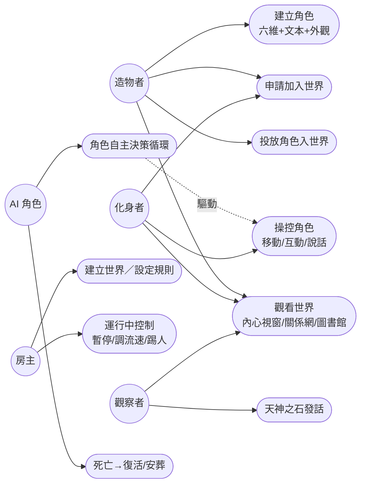
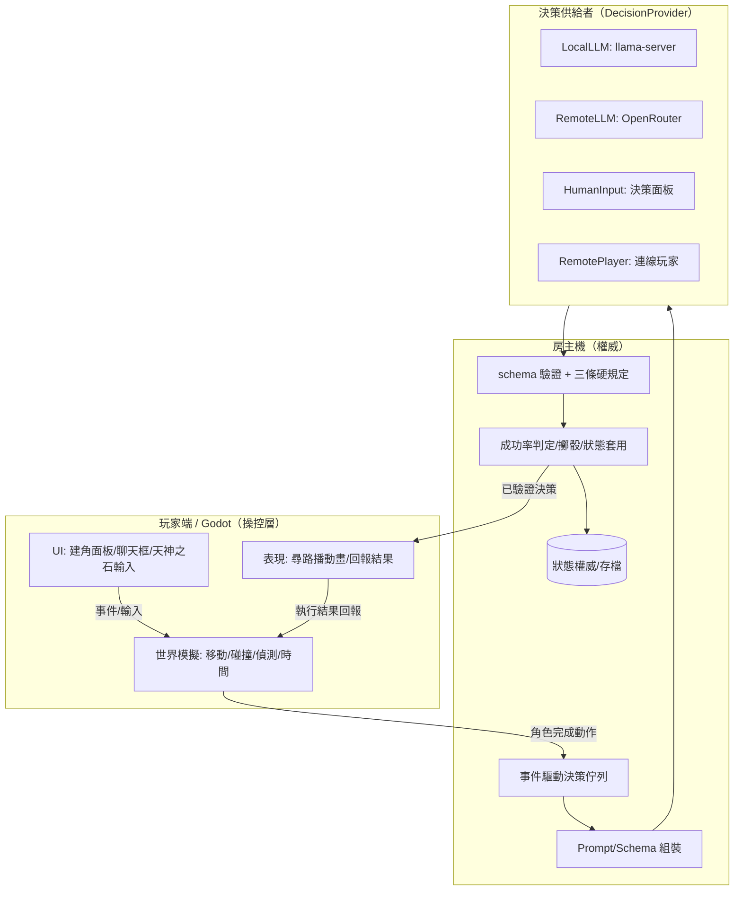
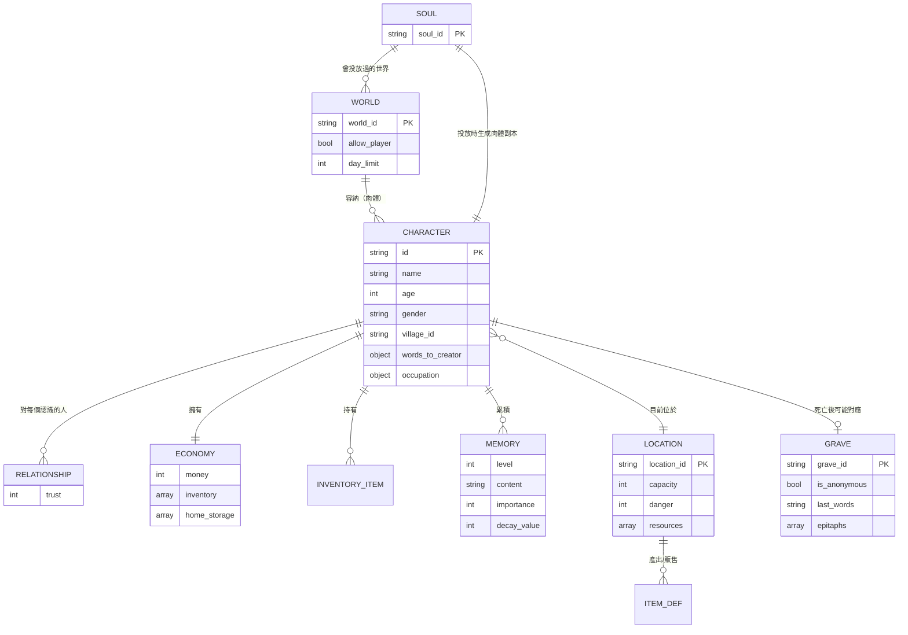
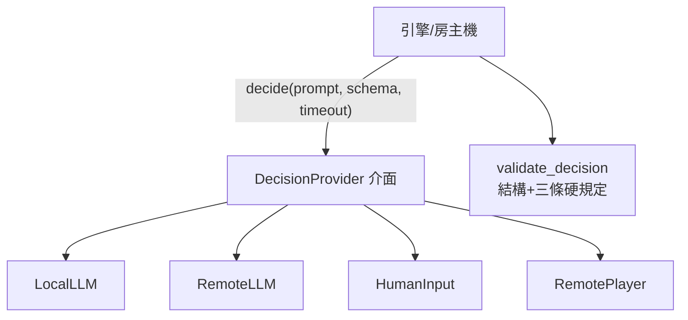
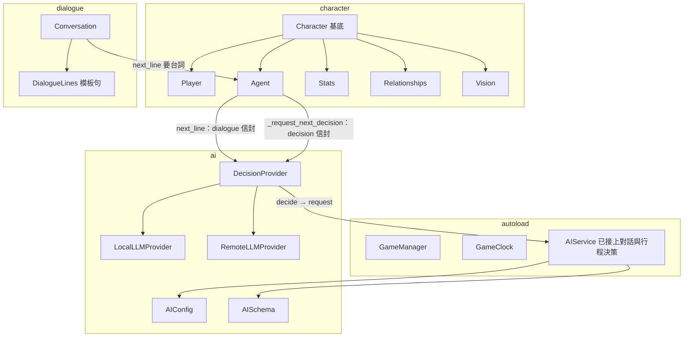
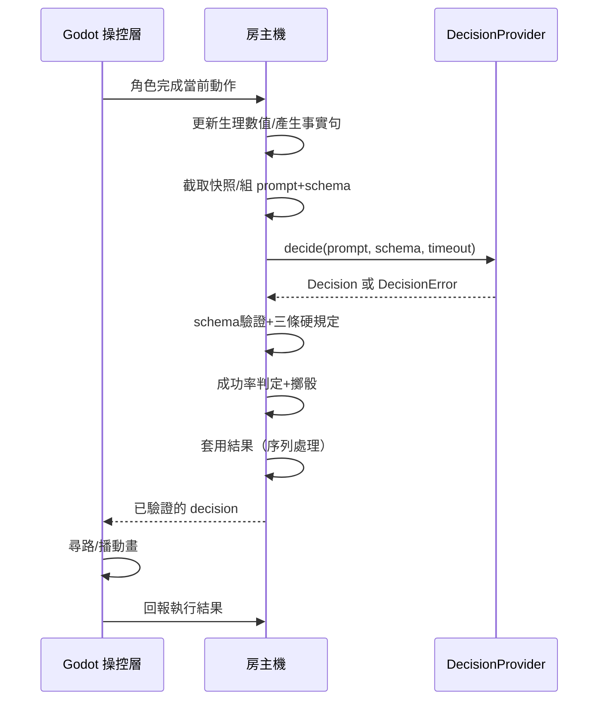
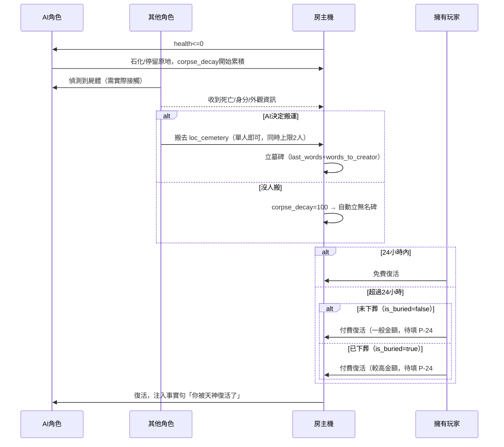

# 13_系統分析與系統設計

# 13｜系統分析與系統設計（SA/SD）

**閱讀對象**：你自己（整理全案架構用，非團隊正式交付文件）
**文件性質**：整合《00》~《12》既有規格的系統分析／系統設計總覽，外加 MVP 範圍切分。**不重複已定案的細節**——能連回原文件的一律連回去；本文件真正新產出的只有「使用案例」「跨文件彙整圖」「MVP 範圍」三塊。
**前置閱讀**：《00 設計原則與架構》

> ⚠️ 第三節「MVP 範圍」已於 2026-08-16 逐項核過，可依此排工；表中標「待規劃」的兩個新機制（搬運、對話機制細節）架構已定但數值/邊界尚未定案，見對應追蹤。其餘章節皆彙整自已定案或已寫入規格書的內容，未定案處照樣標記【推測待確認】／【待填】並連回《99》。

---

# 一、系統分析（System Analysis）

## 1. 系統範圍

Ailley 是 LLM 驅動的 2D 像素村莊（Godot 4.5.1）。角色分 Player（玩家操控）與 Agent（AI 操控），兩者共用同一個基底——核心約束是「Player 能做到的，Agent 也必須能做到」（《00》）。世界可單機可連線，可以有玩家在場也可以純粹放著讓 AI 角色自己生活（《10》）。

## 2. 使用者角色（Actors）

依《10》§2.1 三個設定軸與 §1 名詞定義：

| Actor        | 定義                                                            | 對應規格        |
| ------------ | ------------------------------------------------------------- | ----------- |
| 房主           | 建立世界的玩家，世界跑在他機器上，狀態權威主機                                       | 《10》§1、§6.5 |
| 化身者          | 親自操控一名角色（Player）                                              | 《10》§2.1    |
| 造物者          | 投放 AI 角色（Agent）入世界，自己不下場                                      | 《10》§2.1    |
| 觀察者          | 不投放角色，僅觀看＋用天神之石                                               | 《10》§2.1、§9 |
| AI 角色（Agent） | 系統內部 actor，由 DecisionProvider 驅動自主決策                          | 《00》§7、《12》 |
| 決策供給者        | LocalLLM／RemoteLLM／HumanInput／RemotePlayer 四種來源之一，實際「想」出決策的一方 | 《12》§3      |

同一個真人玩家在不同世界、甚至同一世界的不同時刻可以身兼多個角色（例如同時是房主又是化身者）。

## 3. 使用案例（Use Cases）

未涵蓋在這張圖但已定案的次要案例：角色履歷查詢（《10》§8.5）、世界結算與圖書館（《10》§10）、悼詞留言（《09》§4-4）。

## 4. 功能需求總覽

不重寫內容，只列「這塊功能歸哪份文件管」：

| 功能區塊 | 權威文件 | 定案程度 |
| --- | --- | --- |
| 角色資料契約（L0~L3） | 《01》 | 已定案 |
| 建角流程／6→10 轉換 | 《01-1》 | 已定案 |
| 行為成功率判定 | 《01-2》 | 數值待填 |
| Prompt 注入策略 | 《01-3》 | 方案待選（P-03） |
| 情緒與特殊狀態 | 《02》 | 含推測 |
| 記憶四層架構 | 《03》 | 含推測 |
| Godot↔AI 通訊契約 | 《04》 | 參數待填 |
| 建角 UI | 《05》 | 含推測 |
| 遊戲內 UI | 《15》 | 大致定案 |
| 地點與行動 | 《07》＋`07_地點/` | 含推測 |
| 物品與經濟 | 《08》 | 含推測 |
| 死亡／屍體／復活／墓園 | 《09》 | 大致定案 |
| 世界模式／連線／時間系統 | 《10》 | 已定案 |
| 人際互動與社交行動 | 《11》 | 含推測 |
| 決策來源抽象 | 《12》 | 已定案 |

## 5. 非功能需求

| 類別 | 需求 | 現行數值／規格 | 來源 |
| --- | --- | --- | --- |
| 容量 | 單世界村民數 | 5 人（架構須預留可擴充） | 《00》§3 |
| 容量 | 單機同時運行 Agent 數 | MVP 5，未來版 10（別寫死） | 《00》§3 |
| 效能 | 決策逾時預算 | `TICK_BUDGET`【待填】 | 《12》§9 |
| 效能 | `/decide` 逾時建議值 | 5 秒【待填】 | 《04》§6 |
| 效能 | AI 呼叫頻率上限 | 同角色最短 30 秒間隔、每遊戲日 20 次；**對話呼叫豁免**（`CONVERSATION` policy 跳過冷卻與每日配額，走獨立計數） | `ai/api.md`（`AIService`） |
| 安全 | 提示詞注入防禦 | 白名單驗證＋三條硬規定，房主機端強制 | 《12》§4 |
| 安全 | API 金鑰 | 存 `user://`，不進版控，log 一律遮蔽 | `ai/api.md`（`AIConfig`） |
| 可擴充性 | 決策來源可插拔 | `DecisionProvider` 介面，四種實作 | 《12》§3 |
| 容錯 | 決策失敗兜底 | 一律 `idle`，絕不卡住或消失 | 《04》§6 |

## 6. 頂層資料流圖

對應《04》§1、《12》§5.1 的完整職責表；此圖只是把兩份文件的圖合併成一張好記的版本。

---

# 二、系統設計（System Design）

## 1. 系統架構圖

見上方「頂層資料流圖」，架構層級的職責切分表見《04》§1「職責切分原則」，不重複列。單機模式下 Client 與 Host 是同一台機器上的兩個 process；多人模式下 Host 只有一個（房主），Client 可以有多個。

## 2. 資料模型（ER 圖）

依《01》《06》《07》《08》《09》整理出的實體關係：

`personality`（10 項引擎參數）與 `hexaco_input`（6 項建角紀錄）省略在圖外，屬於 CHARACTER 的內部欄位而非獨立實體，完整結構見《06》§1。**靈魂／肉體**的區分見《10》§8.1：SOUL 永久保存，CHARACTER（肉體）是 SOUL 投入某個 WORLD 後的實例。

## 3. 模組／元件設計

分兩張圖：**目標決策架構**（規格書定義，尚未全部實作）與**現況已實作元件**（`ai/api.md`、`腳本地圖.md` 記錄的實際程式碼）。兩者不是同一件事，混在一張圖裡會製造「這功能已經做了」的錯覺。

### 3-1 目標決策架構（《12》定義）

### 3-2 現況已實作元件（Godot 端，摘自 `ai/api.md`）

**現況**：`AIService` 正式線已接上對話（`Agent.next_line()`）與行程決策（`Agent._request_next_decision()`，仲裁器同時吃 schedule 與 llm 兩種來源），`DecisionProvider` 介面（`LocalLLMProvider`／`RemoteLLMProvider`）也已實作（#155）。已用真實 LocalLLM 跑過驗證（#143）：兩隻沒有人格資料的角色在不同情境下產生了不同、對應當下狀況的行程決策 reasoning，對話回應也隨輸入語境變化、不是 `DialogueLines` 模板句。完整落差清單見 `ai/api.md`「已知缺口」與 `技術/腳本地圖.md`「目前還沒做的」。

### 3-3 MVP-1 上線前驗證（issue #175）

用 godot-ai 實跑 `scenes/main.tscn` 驗證過的項目：

| 項目 | 結果 |
| --- | --- |
| Player／Agent 尋徑到 5 個 MVP 地點 | 通過，`NavGrid.find_path()` 從任一起點到 5 個 `PlaceAnchors` 錨點皆可達 |
| 天神之石發話 | 通過，範圍內（`HEAR_RADIUS` 96px）角色收到事實句、寫入 `_daily_events` |
| 商店 `buy_from()` 機制 | 機制本身正確（扣款＋加物品原子成立），但販賣機目前商品清單是佔位資料（`bread`/`water`/`wild_fruit`/`ale`），不是《08》§0 拍板的 5 樣正式清單——上架內容待 #166 |
| `SaveService` 存讀檔（角色＋記憶） | 通過，`save_character()`/`get_character()` 往返，`Memory.get_save_data()`／`load_save_data()` 正確保留 L2/L4 記憶條目 |
| 昏迷送醫流程 | 未驗證，#272 尚未實作 |

依賴的 #118／#143／#150 三則皆已關閉（#118 只涵蓋仲裁常數調參，不含這裡列的項目，本節是額外新增的驗證）。#166／#165（商店上架）、#272（昏迷送醫）仍是缺口，這則保持追蹤，等三則落地後補完剩餘驗證。

## 4. 關鍵情境循序圖

### 4-1 決策循環（事件驅動，目標架構）

完整版（含失敗分支）見《04》§5、《00》§7。

### 4-2 死亡與復活（依《09》§1、§1-1、§8）

真人角色（Player）走同一張圖，不是例外——2026-08-20（issue #368）拍板後，
AI 與真人共用同一套死亡／復活規則，見《09》§1-1／§8。真人唯一保留的不對稱
是不受《10》§8.3 世界禁入限制，不是「無限次復活、不留屍體與墓碑」。

## 5. 介面設計索引

不重複列封包格式與 UI 版位，只指路：

| 介面 | 定義於 |
| --- | --- |
| Godot↔AI 通訊端點與封包 | 《04》§3、§4 |
| 建角面板版面 | 《05》§2~§7 |
| 遊戲內 UI（角色資訊面板、天神之石輸入框） | 《15》 |
| 完整 JSON 資料結構 | 《06》§1 |
| Godot 腳本公開函式 | `ai/api.md`、`技術/腳本地圖.md` |

---

# 三、MVP 範圍（2026-08-16 你逐項核過，細節仍待補完整規格）

目標架構本身不縮水——縮的是「這次先做全量還是簡化版」。世界本身**仍是單機跑**，「地端／雲端／玩家都能佔領世界」指的是**角色的決策來源可以是本機模型、雲端模型、或真人**（對應《12》的 `LocalLLM`／`RemoteLLM`／`HumanInput` 三種 `DecisionProvider`），不是網路連線的多人——`RemotePlayer`（連線玩家）留到多人階段。

MVP 再切三小階段：

- **MVP-1（架構先起來）**：單機村莊，Local／Cloud／Human 三種角色驅動並存，簡化版經濟與社交能跑起來
- **MVP-2（玩家加入後）**：化身者（Player）接上，餐酒館從「沿用販賣機機制」升級成正式版
- **之後**：工作系統完整化才做 `perform`；`偷竊`／`report` 跟《洗心革面所》綁在一起做；死亡／墓園全套、群體對話、八卦、聲望連動的細緻社交後果都留在這裡（後三項已追蹤於《99》P-23）

| 規格模組 | 範圍 | MVP 做法 | 階段 |
| --- | --- | --- | --- |
| 《00》決策循環 | 全量 | 事件驅動架構直接照規格做，不走批次輪詢的回頭路 | MVP-1 |
| 《12》DecisionProvider | 部分全量 | `LocalLLM`／`RemoteLLM`／`HumanInput` 三種做，`RemotePlayer`（多人連線）留到之後 | MVP-1 |
| 《01》/《01-1》角色數值＋建角 | 簡化 | 六維滑桿、10 項人格、`system_prompt`、`words_to_creator` 全做；外觀**不拆 slot**，改提供**固定 6 套**「造型組」整套挑選、素材先用佔位圖（取代 P-01 的完整外觀系統，那個留到之後）；新增 `decision_source`／`model_name` 欄位（見《06》），本機/雲端各自實際用哪個模型也要記錄，供角色面板顯示 | MVP-1 |
| 《01-2》行為判定 | 全量結構＋建議值 | 公式與參數表照做，數值先用文件裡的「建議值」 | MVP-1 |
| 《01-3》Prompt 注入 | 方案 A（固定全量） | 先不做方案 B 的情境預測式分層（P-03 本來就建議 B 列為次一版） | MVP-1 |
| 《02》情緒與狀態 | 簡化 | 8 種情緒全做；`conditions` 先做生理衍生幾項，社會狀態（`detained`/`outcast`）留到之後（MVP 範圍見文件開頭 MVP callout） | MVP-1 |
| 《03》記憶 | 簡化（已定案方向） | 第一版不上向量檢索；L1＋L2 用標籤/關鍵字/連結展開，L3/L4 語意檢索留到之後（MVP 範圍見文件開頭 MVP callout） | MVP-1 |
| 《04》Godot↔AI 介接 | 全量 | 四端點都要，這是地基 | MVP-1 |
| 《05》建角面板 | 簡化 | 分頁 1、2（基本、個性）全做；外觀分頁改成造型組挑選；**新增「決策來源」欄位**（選本機模型／雲端模型，對接《12》，後端介接沿用已有的 `AIService`/`AIConfig`，見 `ai/api.md`） | MVP-1 |
| 《07》地點與行動 | 簡化 | 5 個地點：家／藥草鋪／餐酒館／涼亭／天神之石；工作簡化成**單一工作站，站著即可賺錢**（沿用已實作的 `技術/工作站.md` 機制，不用另外設計）；戰鬥新增 `attack`（毆打）；新增「搬運」子機制見下一列 | MVP-1 |
| 《07》搬運（新機制，待補完整規格） | 待規劃 | 昏迷者可被他人搬運，**目的地由搬運者自己決定**（不限定帶回家）；搬運中在畫面上可見（搬運者拖／抱著對方移動）、消耗搬運者體力、搬運者對被搬運者可做其他互動；**不做全村廣播**，要走到附近才會知道。若 30 遊戲分鐘內沒人搬，自動傳送到藥草鋪由駐點 NPC 治療。速度/體力消耗暫定值、治療時間見《99》P-27 | MVP-1 |
| 《08》物品與經濟 | 簡化 | 餐酒館沿用**已實作的販賣機機制**（`技術/販賣機.md`）當簡化版，不重新設計交易流程；藥草鋪同樣沿用；正式餐酒館玩法留到 MVP-2。**餐酒館要供應酒精類品項**，喝了累加《01》`alcohol` 欄位——這不是新設計，`drunk` condition（《02》MVP 範圍已含）與《03》§6 酒精遺失記憶都已經有機制，MVP 只是要記得在餐酒館把「品項→加 alcohol」這條線接上 | MVP-1 |
| 《09》死亡與復活 | 大幅簡化，改「昏迷」 | MVP 不做死亡／安葬／墓園全套，改用**新狀態**「昏迷」（`health ≤ 0` 觸發，跟既有「暈倒」`stamina` 歸零不是同一件事）：跟死亡一樣石化原地，可被搬運（目的地見上一列），沒有復活流程（本來就沒死）。完整死亡系統留到之後。細節見《99》P-27 | MVP-1 |
| 《10》世界模式與連線 | 大幅簡化 | 世界一律單機跑；「允不允許 player 加入」這個建立時旗標 MVP 先不開放設定（預設允許）。**未來版**：建立世界的介面要能設定是否開放 player 加入（只允許自己／也允許他人），正式的模式選擇留到那時；連線／多人／導演權轉移／席位付費全部不做，但《12》的 `DecisionProvider` 介面設計本身要保留可擴充性，之後接 `RemotePlayer` 不用重構 | MVP-1 |
| 《11》人際互動 | 簡化 | `talk`／`give`／`persuade`／`shout` 全做；`perform` 留到工作系統完整化後；`report` 跟偷竊、《洗心革面所》綁在一起延後；§3 群體對話／八卦／聲望細緻後果不進 MVP（已追蹤於《99》P-23）。**新增 `murmur`（自語）**：跟 `talk` 不同層級，不開 `Conversation` 物件，像一般動作一樣只發起一次，講給自己聽 | MVP-1（`perform`/`report` 除外） |
| 對話機制（新機制，待補完整規格） | 待規劃 | `talk` 現況已是多輪 `Conversation` 物件（見 `技術/talk 動作設計.md`），MVP 沿用，**不是一次性單句**；`murmur` 才是一次性單句，見上一列。等待對方回話的逾時秒數對接《12》§6.2（P-22 待填）；**三人以上同場對話評估過偏複雜**（誰先講/誰決定結束的仲裁邏輯要重寫、單輪決策請求會變多方、prompt 要塞多人視角、UI 氣泡會互相遮擋），MVP 先維持現有 2 人限制，第三人在場時排隊等現有對話結束，完整設計留到之後（已追蹤於《99》P-23） | MVP-1 |
| UI 補齊 | 部分已有 | 角色狀態面板**已實作**（`status_panel.gd`）。**快捷欄／物品欄 UI 已實作但是給 player 用的**——MVP-1 還沒接 player，暫時用不到，等 MVP-2 玩家加入才需要。**MVP-1 需要、目前完全沒做的有三個，優先級相同**：天神之石輸入框、今日摘要面板（`today_plan`／做過什麼）、身上物品面板。缺的 UI 都要有對應機制/資料同步做出來，不是純版面；做之前先用文字佔位（沿用 `status_panel.gd` 的 `AGE_PLACEHOLDER := "—"` 做法，不留空白也不顯示假數值）。**詳細規格已定義，見《[[15_遊戲內 UI 規格]]》**（三個面板併成一個角色資訊面板的三分頁，理由見該文件 §2-1）；建角面板的「決策來源」欄位與造型組挑選 UI 見《05》§3-1／§5-0 | MVP-1 |
| 存檔 | 全量 | 角色／世界兩層分開存，已拆 issue #19–#23 | MVP-1 |
| 餐酒館正式版 | 之後 | 化身者（Player）接上後，把沿用販賣機機制的簡化版升級成正式餐酒館玩法 | MVP-2 |
| 死亡／墓園全套（《09》） | 之後 | 「昏迷」先頂著跑；正式死亡／安葬／墓園系統留到 MVP-2 之後 | 之後 |
| `perform` | 之後 | 等《11》以外的工作系統（職業／收入循環）成形再做 | 之後 |
| `report`／偷竊 | 之後 | 跟《洗心革面所》一起做，三者互相依賴 | 之後 |
| 群體對話／八卦／聲望連動社交後果 | 之後 | 《99》P-23 已追蹤，不重複列 | 之後 |

