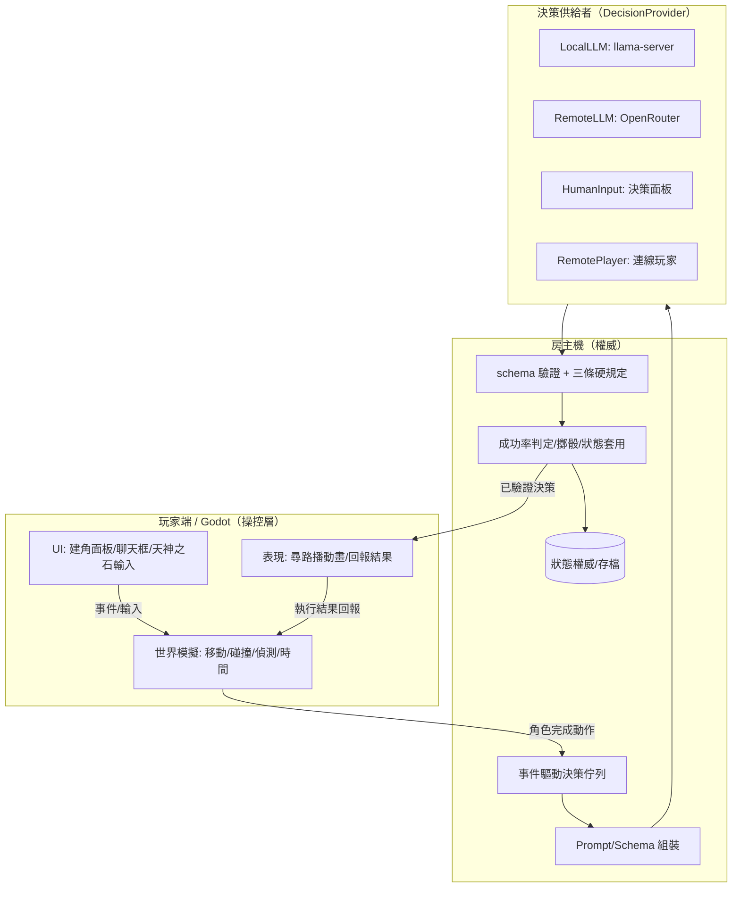
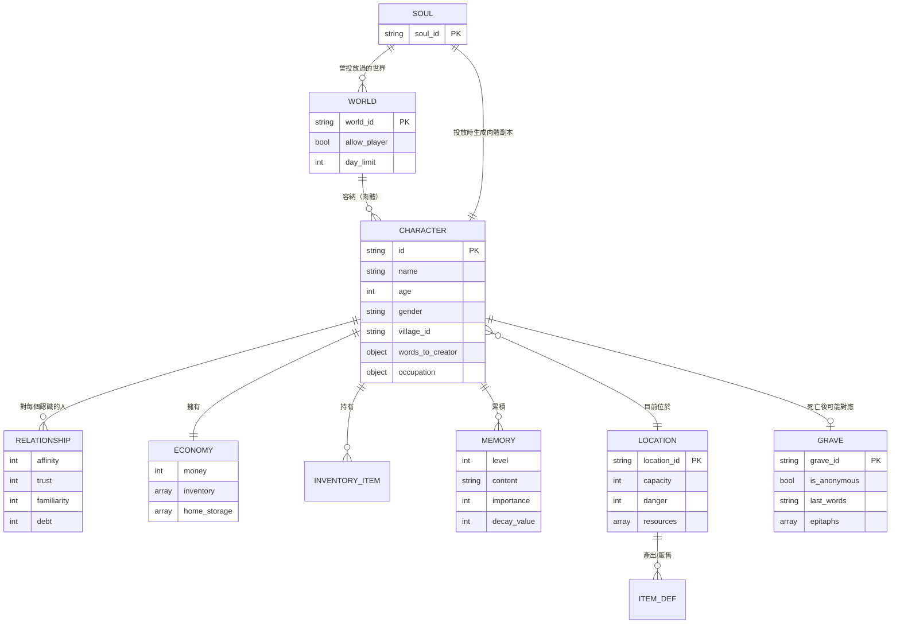
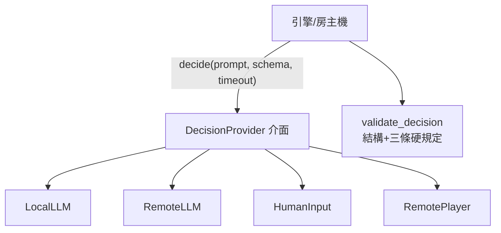
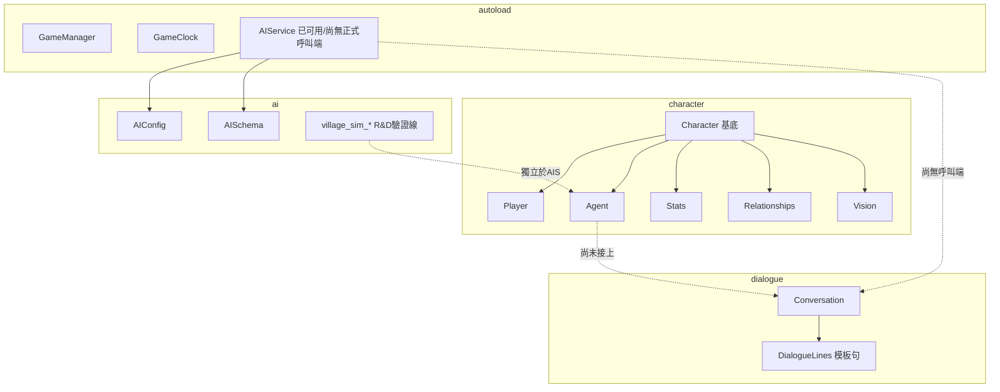
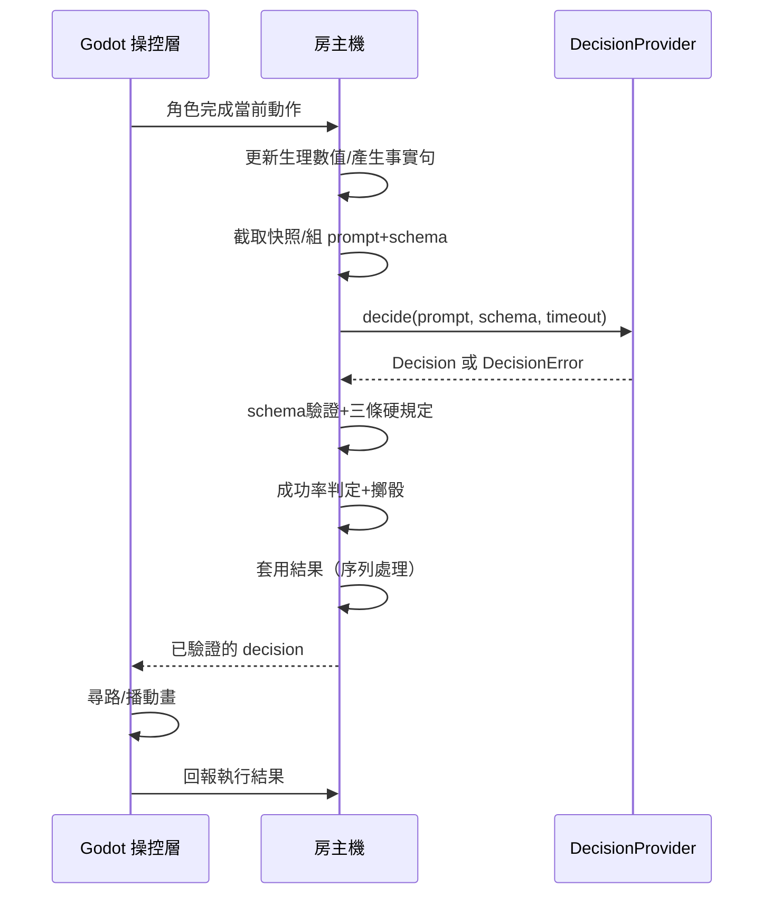
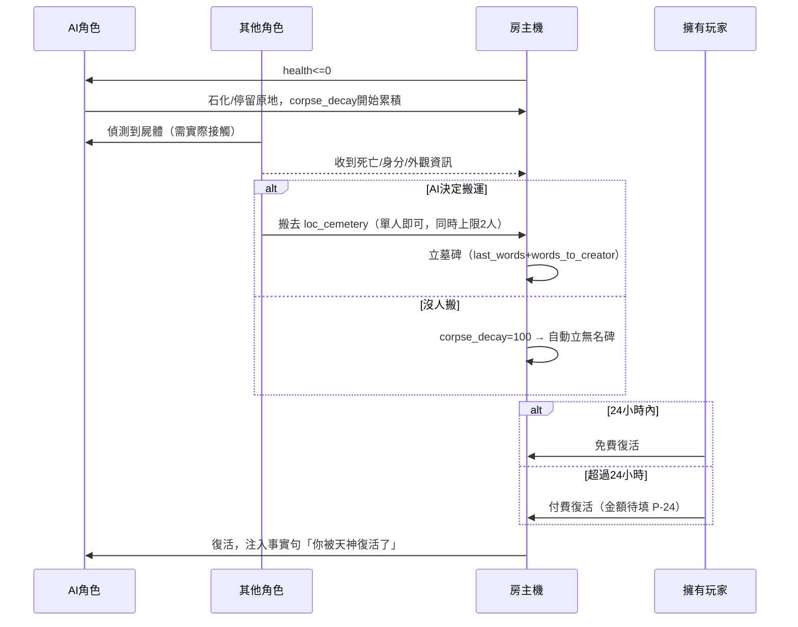

# 13_系統分析與系統設計

# 13｜系統分析與系統設計（SA/SD）

**閱讀對象**：你自己（整理全案架構用，非團隊正式交付文件）
**文件性質**：整合《00》~《12》既有規格的系統分析／系統設計總覽，外加 MVP 範圍切分。**不重複已定案的細節**——能連回原文件的一律連回去；本文件真正新產出的只有「使用案例」「跨文件彙整圖」「MVP 範圍」三塊。
**前置閱讀**：《00 設計原則與架構》

> ⚠️ 第三節「MVP 範圍」是我的建議草案，尚未經你確認，別直接照著排工。其餘章節皆彙整自已定案或已寫入規格書的內容，未定案處照樣標記【推測待確認】／【待填】並連回《99》。

---

# 一、系統分析（System Analysis）

## 1. 系統範圍

Ailley 是 LLM 驅動的 2D 像素村莊（Godot 4.5.1）。角色分 Player（玩家操控）與 Agent（AI 操控），兩者共用同一個基底——核心約束是「Player 能做到的，Agent 也必須能做到」（《00》）。世界可單機可連線，可以有玩家在場也可以純粹放著讓 AI 角色自己生活（《10》）。

## 2. 使用者角色（Actors）

依《10》§2.1 三個設定軸與 §1 名詞定義：

| Actor | 定義 | 對應規格 |
| --- | --- | --- |
| 房主 | 建立世界的玩家，世界跑在他機器上，狀態權威主機 | 《10》§1、§6.5 |
| 化身者 | 親自操控一名角色（Player） | 《10》§2.1 |
| 造物者 | 投放 AI 角色（Agent）入世界，自己不下場 | 《10》§2.1 |
| 觀察者 | 不投放角色，僅觀看＋用天神之石 | 《10》§2.1、§9 |
| AI 角色（Agent） | 系統內部 actor，由 DecisionProvider 驅動自主決策 | 《00》§7、《12》 |
| 決策供給者 | LocalLLM／RemoteLLM／HumanInput／RemotePlayer 四種來源之一，實際「想」出決策的一方 | 《12》§3 |

同一個真人玩家在不同世界、甚至同一世界的不同時刻可以身兼多個角色（例如同時是房主又是化身者）。

## 3. 使用案例（Use Cases）

未涵蓋在這張圖但已定案的次要案例：角色履歷查詢（《10》§8.5）、世界結算與圖書館（《10》§10）、悼詞留言（《09》§4-4）。

## 4. 功能需求總覽

不重寫內容，只列「這塊功能歸哪份文件管」：

| 功能區塊 | 權威文件 | 定案程度 |
| --- | --- | --- |
| 角色資料契約（L0~L3） | 《01》 | 已定案 |
| 建角流程／6→10 轉換 | 《01-1》 | 已定案 |
| 行為成功率判定 | 《01-2》 | 數值待填 |
| Prompt 注入策略 | 《01-3》 | 方案待選（P-03） |
| 情緒與特殊狀態 | 《02》 | 含推測 |
| 記憶四層架構 | 《03》 | 含推測 |
| Godot↔AI 通訊契約 | 《04》 | 參數待填 |
| 建角 UI | 《05》 | 含推測 |
| 地點與行動 | 《07》＋`07_地點/` | 含推測 |
| 物品與經濟 | 《08》 | 含推測 |
| 死亡／屍體／復活／墓園 | 《09》 | 大致定案 |
| 世界模式／連線／時間系統 | 《10》 | 已定案 |
| 人際互動與社交行動 | 《11》 | 含推測 |
| 決策來源抽象 | 《12》 | 已定案 |

## 5. 非功能需求

| 類別 | 需求 | 現行數值／規格 | 來源 |
| --- | --- | --- | --- |
| 容量 | 單世界村民數 | 5 人（架構須預留可擴充） | 《00》§3 |
| 容量 | 單機同時運行 Agent 數 | 2（暫定，別寫死） | `決策.md` |
| 效能 | 決策逾時預算 | `TICK_BUDGET`【待填】 | 《12》§9 |
| 效能 | `/decide` 逾時建議值 | 5 秒【待填】 | 《04》§6 |
| 效能 | AI 呼叫頻率上限 | 同角色最短 30 秒間隔、每遊戲日 20 次；**對話呼叫豁免**（`CONVERSATION` policy 跳過冷卻與每日配額，走獨立計數） | `ai/api.md`（`AIService`） |
| 安全 | 提示詞注入防禦 | 白名單驗證＋三條硬規定，房主機端強制 | 《12》§4 |
| 安全 | API 金鑰 | 存 `user://`，不進版控，log 一律遮蔽 | `ai/api.md`（`AIConfig`） |
| 可擴充性 | 決策來源可插拔 | `DecisionProvider` 介面，四種實作 | 《12》§3 |
| 容錯 | 決策失敗兜底 | 一律 `idle`，絕不卡住或消失 | 《04》§6 |

## 6. 頂層資料流圖

對應《04》§1、《12》§5.1 的完整職責表；此圖只是把兩份文件的圖合併成一張好記的版本。

---

# 二、系統設計（System Design）

## 1. 系統架構圖

見上方「頂層資料流圖」，架構層級的職責切分表見《04》§1「職責切分原則」，不重複列。單機模式下 Client 與 Host 是同一台機器上的兩個 process；多人模式下 Host 只有一個（房主），Client 可以有多個。

## 2. 資料模型（ER 圖）

依《01》《06》《07》《08》《09》整理出的實體關係：

`personality`（10 項引擎參數）與 `hexaco_input`（6 項建角紀錄）省略在圖外，屬於 CHARACTER 的內部欄位而非獨立實體，完整結構見《06》§1。**靈魂／肉體**的區分見《10》§8.1：SOUL 永久保存，CHARACTER（肉體）是 SOUL 投入某個 WORLD 後的實例。

## 3. 模組／元件設計

分兩張圖：**目標決策架構**（規格書定義，尚未全部實作）與**現況已實作元件**（`ai/api.md`、`腳本地圖.md` 記錄的實際程式碼）。兩者不是同一件事，混在一張圖裡會製造「這功能已經做了」的錯覺。

### 3-1 目標決策架構（《12》定義）

### 3-2 現況已實作元件（Godot 端，摘自 `ai/api.md`）

**現況與目標的落差**（勿誤讀成已完成）：`AIService`（正式線）已可用但**尚未接上對話與行程**；`village_sim_*`（R&D 驗證線）已能驅動 `move_to`／說話，但只證明管線通、決策內容有效性未驗證，且不是出貨架構；`DecisionProvider` 介面**尚未實作**，現況是直接呼叫 llama-server。完整落差清單見 `ai/api.md`「已知缺口」與 `技術/腳本地圖.md`「目前還沒做的」。

## 4. 關鍵情境循序圖

### 4-1 決策循環（事件驅動，目標架構）

完整版（含失敗分支）見《04》§5、《00》§7。

### 4-2 死亡與復活（依《09》§1、§1-1、§8）

真人角色（Player）不走此圖，見《09》§1-1：無限次復活、不留屍體與墓碑。

## 5. 介面設計索引

不重複列封包格式與 UI 版位，只指路：

| 介面 | 定義於 |
| --- | --- |
| Godot↔AI 通訊端點與封包 | 《04》§3、§4 |
| 建角面板版面 | 《05》§2~§7 |
| 完整 JSON 資料結構 | 《06》§1 |
| Godot 腳本公開函式 | `ai/api.md`、`技術/腳本地圖.md` |

---

# 三、MVP 範圍（建議草案，待確認）

目標架構本身不縮水——縮的是「這次先做全量還是簡化版」。對照《交流/計畫》既有的四階段順序（進行中：LLM對話 → 存檔 → 生活空間 → 無player的世界 → 多人），MVP 大致落在「LLM對話＋存檔＋生活空間」做完的那個時間點：一個能養一兩隻有記憶、有個性、會自己找事做的 Agent 的單機村莊，多人與「無 player 世界」的特殊處理留到那兩個階段自然做。

| 規格模組 | MVP 做法 | 簡化說明／現況 | 對應階段 |
| --- | --- | --- | --- |
| 《00》決策循環 | 全量 | 事件驅動架構直接照規格做，不走批次輪詢的回頭路（省下之後重寫一次） | 進行中 |
| 《12》DecisionProvider | 全量（純重構） | 文件自己標「本期建議完成，純重構、不改變現有行為」，直接照 §7.1 六項任務做 | 進行中 |
| 《01》/《01-1》角色數值＋建角 | 全量 | 六維滑桿、10 項人格、`system_prompt` 組裝都做；`words_to_creator` 一併做 | 進行中 |
| 《01-2》行為判定 | 全量結構＋建議值 | 公式與參數表照做，數值先用文件裡的「建議值」，不等平衡測試 | 進行中 |
| 《01-3》Prompt 注入 | 方案 A（固定全量） | 先不做方案 B 的情境預測式分層，等 token 成本實測後再決定要不要優化（P-03 本來就建議 B 列為次一版） | 進行中 |
| 《02》情緒與狀態 | 簡化 | 8 種情緒全做；`conditions` 先做生理衍生幾項（`injured`/`drunk`/`starving`/`dehydrated`/`exhausted`），社會狀態（`detained`/`outcast`）留到「生活空間」後期 | 生活空間 |
| 《03》記憶 | 簡化（已定案方向） | 第一版不上向量檢索（`決策.md` 已定案）；L1 短期＋L2 近期用標籤/關鍵字/連結展開，L3/L4 語意檢索留到之後 | 存檔 |
| 《04》Godot↔AI 介接 | 全量 | `/decide`／`/event`／`/generate/words`／`/memory/reflect` 四端點都要，這是地基 | 進行中 |
| 《05》建角面板 | 簡化 | 分頁 1、2（基本、個性）先做；分頁 3 外觀因 slot 清單未定（P-01），先給固定預設外觀或極簡挑選 | 生活空間 |
| 《07》地點與行動 | 簡化 | 先做 4~6 個地點（家、餐酒館、森林、藥草叢、藥草鋪、湖泊即可覆蓋食衣住行），行動先做 B/C 類（工作、移動），D 類（偷竊/攻擊）與天神之石以外的地點延後 | 生活空間 |
| 《08》物品與經濟 | 簡化 | 基本買賣＋腐壞照做，堆疊規則用文件建議值，商鋪無限庫存（文件本身也建議不做商鋪經營模擬） | 生活空間 |
| 《09》死亡與復活 | 簡化 | 死亡／安葬／墓碑照做；付費復活先跳過，24 小時內免費復活覆蓋大部分情境即可 | 生活空間之後 |
| 《10》世界模式與連線 | 大幅簡化 | 只做「單機・純觀察」＋「單機・化身」兩種世界類型；連線／多人／導演權轉移／席位付費全部不做 | 無 player 世界之前都不需要 |
| 《11》人際互動 | 簡化 | `talk`／`give` 先做；`persuade`／`report`／`shout`／`perform` 可延後；§3 待補的群體對話/八卦不進 MVP | 生活空間 |
| 存檔 | 全量（依《決策》既有排序） | 這是《計畫》第二階段的地基，角色／世界兩層分開存，已拆 issue #19–#23 | 存檔 |

**不在此表但擋路的現況落差**（見二-3-2）：`AIService` 正式線尚未接上對話與行程、`DecisionProvider` 尚未實作——這兩項是 MVP 能不能成立的前提，不是「要不要做」的選擇題。

